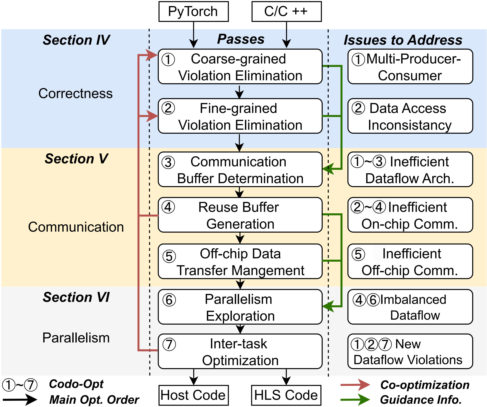

# CODO: An Automated Compiler for Comprehensive Dataflow Optimization

<p align="center">
  
</p>

CODO is an automated compiler for building efficient FPGA dataflow accelerators from high-level programs. It addresses the key challenges in large-scale dataflow design for HLS, including preserving correct streaming behavior, improving data movement efficiency, and balancing parallelism under resource constraints. Built on MLIR, CODO systematically detects and eliminates both coarse-grained and fine-grained dataflow violations, optimizes on-chip and off-chip communication, and uses design space exploration to improve performance while reducing resource consumption. 

CODO was accepted to ISCA 2026 and selected as an **ISCA 2026 Best Paper Award Finalist**.

This repository contains the artifact evaluation package for the CODO paper.

## 1. Clone the Repository

```sh
git clone git@github.com:sjtu-zhao-lab/codo.git -b codo-ae
cd codo
git submodule update --init --recursive --progress

# Alternative:
# git submodule update --init --recursive
```

---

## 2. Build Docker Image

```sh
docker build \
  --build-arg UID=$(id -u) \
  --build-arg GID=$(id -g) \
  -f Docker/Dockerfile.ae \
  -t codo_ae_image:v2 \
  .
```

---

## 3. Launch the Container

```sh
./run_ae.sh
```

---

## 4. Build the Project

### 4.1 Inside the Docker Container

#### Step 1: Build `torch-mlir`

```sh
cd third-party/torch-mlir/
python3 -m venv mlir_venv
source mlir_venv/bin/activate

python3 -m pip install --upgrade pip
python3 -m pip install -r requirements.txt

cmake -GNinja -Bbuild \
  -DCMAKE_BUILD_TYPE=Release \
  -DPython3_FIND_VIRTUALENV=ONLY \
  -DLLVM_ENABLE_PROJECTS=mlir \
  -DLLVM_EXTERNAL_PROJECTS="torch-mlir" \
  -DLLVM_EXTERNAL_TORCH_MLIR_SOURCE_DIR="$PWD" \
  -DMLIR_ENABLE_BINDINGS_PYTHON=ON \
  -DLLVM_TARGETS_TO_BUILD=host \
  externals/llvm-project/llvm

pip install pybind11==2.11.1
cmake --build build

cd ../..
```

---

#### Step 2: Build CODO

```sh
./compail.sh
```

---

## 5. Example Workflow (GPT-2)

Taking the GPT-2 model as an example, the following steps demonstrate how to perform optimized compilation and correctness verification using CODO.

> **Note**:
>
> * When optimizing CNN models, set `codo-opt=graph`.
> * `codo-translate -emit-vitis-host` generates the host file.
> * `codo-translate -emit-vpp-link` generates the configuration file.

---

### Step 1: Navigate to the Verification Directory

```sh
cd ./experiments/verify
```

---

### Step 2: Set Environment Variables

```sh
export PYTHONPATH=""
export PYTHONPATH=$PYTHONPATH:/home/devuser/workspace/third-party/torch-mlir/build/tools/torch-mlir/python_packages/torch_mlir
```

---

### Step 3: Generate Initial MLIR File

```sh
python gen_mlir_designs.py \
  --benchmark transformers \
  --model GPT2 \
  --model-folder pymodels \
  --output-path ./designs
```

The generated MLIR file is located at:

```
/home/devuser/workspace/experiments/verify/designs/GPT2/mlir/input/GPT2.mlir
```

---

### Step 4: Optimize MLIR with CODO

```sh
/home/devuser/workspace/build/bin/codo-opt \
  -codo-mm-opt="top-func=main_graph debug-point=10" \
  ./designs/GPT2/mlir/input/GPT2.mlir \
  -o ./designs/GPT2/mlir/kernel/GPT2.mlir
```

The optimized MLIR file will be saved at:

```
./designs/GPT2/mlir/kernel/GPT2.mlir
```

---

### Step 5: Convert MLIR to C++ (Kernel)

```sh
/home/devuser/workspace/build/bin/codo-translate \
  -emit-vitis-hls \
  ./designs/GPT2/mlir/kernel/GPT2.mlir \
  -o ./designs/GPT2/hls/src/GPT2.cpp
```

---

### Step 6: Generate MLIR for Testbench (Verification)

```sh
/home/devuser/workspace/build/bin/codo-opt \
  ./designs/GPT2/mlir/input/GPT2.mlir \
  -codo-verify-pipeline \
  > ./designs/GPT2/mlir/host/GPT2.mlir
```

---

### Step 7: Convert Testbench MLIR to C++

```sh
/home/devuser/workspace/build/bin/codo-translate \
  ./designs/GPT2/mlir/host/GPT2.mlir \
  -emit-vitis-hls \
  -vitis-hls-weights-dir="./designs/GPT2/hls/data" \
  -vitis-hls-is-host=true \
  -o ./designs/GPT2/hls/src/GPT2_tb.cpp

python fix_testbench.py \
  ./designs/GPT2/hls/src/GPT2.cpp \
  ./designs/GPT2/hls/src/GPT2_tb.cpp
```

---

### Step 8: Compile the Testbench

```sh
export PRJ_PATH=./designs/GPT2/hls

g++ \
  ./designs/GPT2/hls/src/GPT2_tb.cpp \
  ./designs/GPT2/hls/src/GPT2.cpp \
  -lm \
  -I${XILINX_HLS}/include \
  -o ./designs/GPT2/hls/GPT2.bin
```

---

### Step 9: Run Correctness Verification

```sh
ulimit -s unlimited
./designs/GPT2/hls/GPT2.bin
```

If the output shows:

```
PRJ_PATH: ./designs/GPT2/hls
```

then the correctness verification has passed successfully.

---

## 6. Synthesis and On-Board Validation

To perform synthesis or on-board validation using the optimized code, please refer to the contents in the `experiments` directory.

---

## Citation

```bibtex
@misc{zhang2026codoautomatedcompilercomprehensive,
      title={CODO: An Automated Compiler for Comprehensive Dataflow Optimization}, 
      author={Weichuang Zhang and Yiquan Wang and Xinzhou Zhang and Chi Zhang and Yu Feng and Xiaofeng Hou and Chao Li and Jieru Zhao and Minyi Guo},
      year={2026},
      eprint={2604.12618},
      archivePrefix={arXiv},
      primaryClass={cs.AR},
      url={https://arxiv.org/abs/2604.12618}, 
}
```

## Acknowledgements

Some parts of CODO were modified, extended, and/or borrowed from [HIDA](https://github.com/UIUC-ChenLab/ScaleHLS-HIDA), [Allo](https://github.com/cornell-zhang/allo), and [StreamHLS](https://github.com/UCLA-VAST/Stream-HLS).
